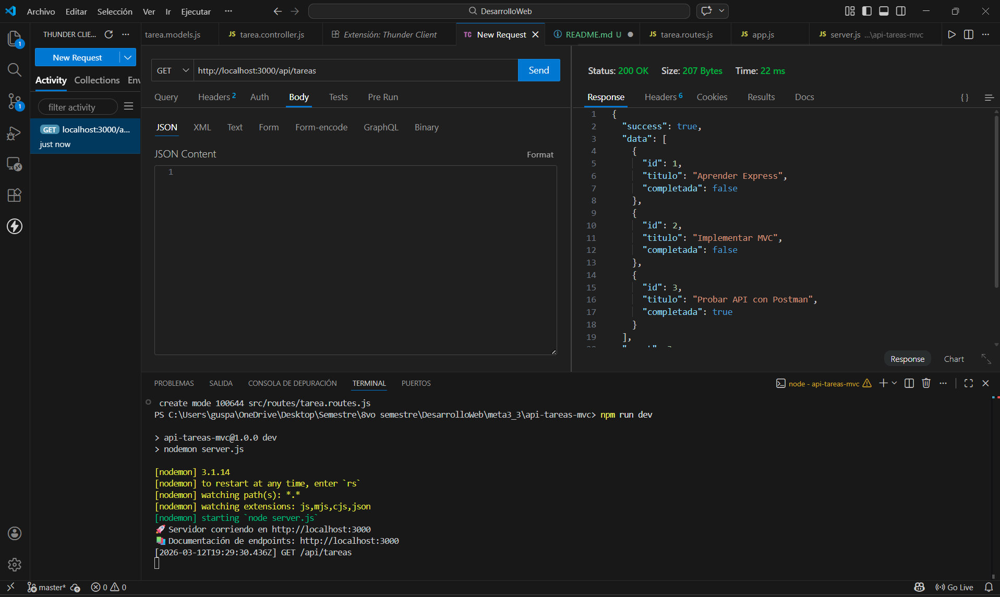
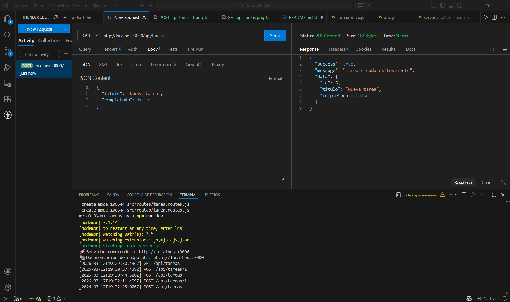
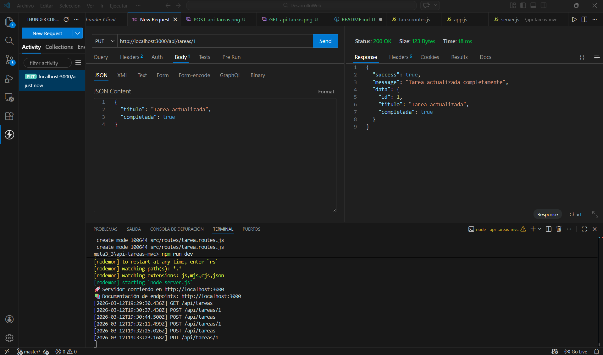
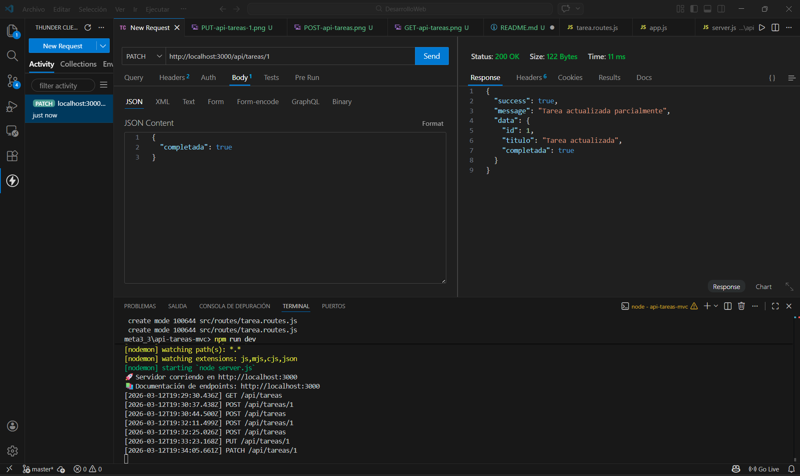
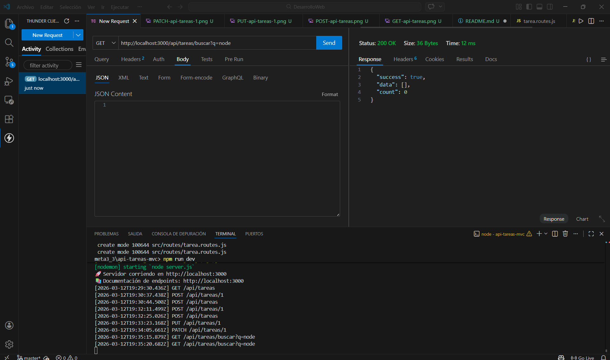
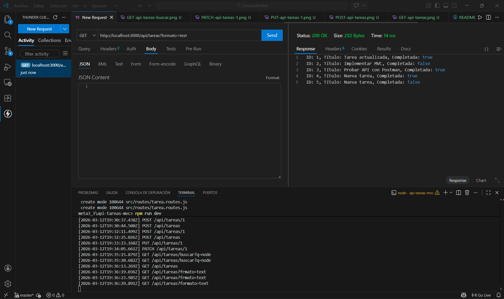

Descripción del proyecto
Desarrollo de un API REST para gestionar un recurso de tareas. La API permite crear, leer, actualizar y eliminar tareas, utilizando únicamente una lista en memoria como persistencia. 

Instrucciones de instalación 
Configuración inicial: 
1. Clonar el repositorio:
git clone https://github.com/GustHernandez/Desarrollo-web-meta-3.1.git

2. Instalar dependencias:
npm install

3. Instalar Express: 
npm install express

4. Intala nodemon como dependencia de desarrollo: 
npm install --save-dev nodemon

5. Ejecutar el servidor:
npm run dev

Lista de endpoints disponibles
| Método | Endpoint          | Descripción                        | Body (JSON)                                           |
| ------ | ----------------- | ---------------------------------- | ----------------------------------------------------- |
| GET    | `/api/tareas`     | Obtener todas las tareas           | -                                                     |
| GET    | `/api/tareas/:id` | Obtener una tarea por ID           | -                                                     |
| POST   | `/api/tareas`     | Crear una nueva tarea              | `{"titulo": "Nueva tarea", "completada": false}`      |
| PUT    | `/api/tareas/:id` | Actualizar completamente una tarea | `{"titulo": "Tarea actualizada", "completada": true}` |
| PATCH  | `/api/tareas/:id` | Actualizar parcialmente una tarea  | `{"completada": true}`                                |
| DELETE | `/api/tareas/:id` | Eliminar una tarea                 | -                                                     |
| GET    | `/api/tareas/buscar?q=texto`| Buscar tareas por titulo |                                                      | 

Capturas de pantalla de las pruebas en Postman

